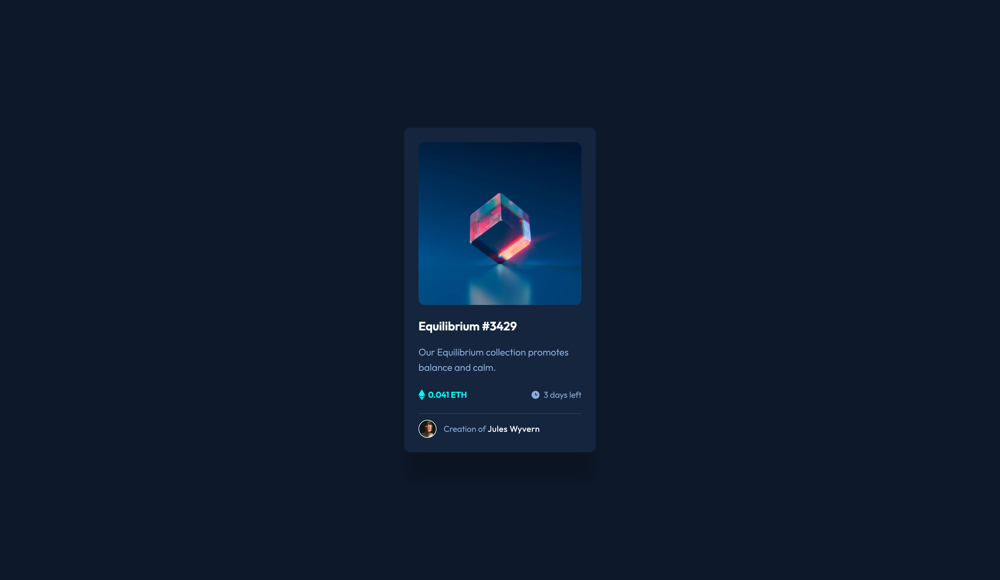

# Frontend Mentor - NFT preview card component solution

This is a solution to the [NFT preview card component challenge on Frontend Mentor](https://www.frontendmentor.io/challenges/nft-preview-card-component-SbdUL_w0U).

Live demo: https://mikes-sandbox.github.io/challenges-nft-card-preview/

## Overview

### Screenshot

### Links

- Solution URL: [GitHub Repo](https://github.com/mikes-sandbox/challenges-nft-card-preview)
- Live Site URL: [GitHub Pages](https://mikes-sandbox.github.io/challenges-nft-card-preview/)

### Built with
 
- Semantic HTML5 markup
- CSS custom properties
- Flexbox
- CSS Grid
- Mobile-first workflow
- [React](https://reactjs.org/)

## Author

- Frontend Mentor - [@mikes-sandbox](https://www.frontendmentor.io/profile/mikes-sandbox)
